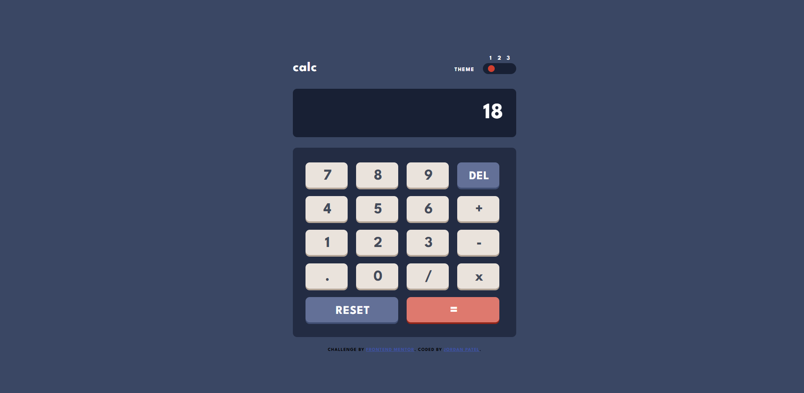
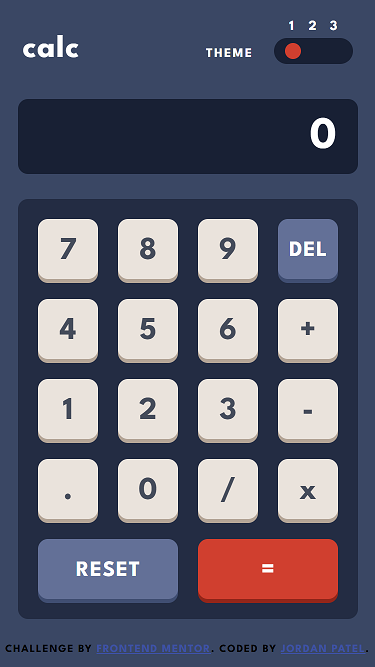

# Calculator App with Theme Switcher

This is a solution to the [Calculator app challenge on Frontend Mentor](https://www.frontendmentor.io/challenges/calculator-app-9lteq5N29). Frontend Mentor challenges help you improve your coding skills by building realistic projects. 

Difficulty: Level 3 (Intermediate)

## Overview

### The challenge

Users should be able to:

- See the size of the elements adjust based on their device's screen size
- Perform mathmatical operations like addition, subtraction, multiplication, and division
- Adjust the color theme based on their preference

### Links

- Live Site URL: [https://jordansgit.github.io/calculator-app-main/](https://jordansgit.github.io/calculator-app-main/)

### Built with

- HTML5 
- CSS 
- JavaScript

### Screenshot

Desktop 

Mobile 

